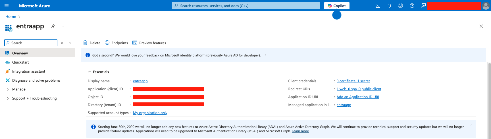

# Installation

## Quick Deploy
[](https://heroku.com/deploy)
[](https://portal.azure.com/#create/Microsoft.Template/uri/https%3A%2F%2Fraw.githubusercontent.com%2FYOUR_USERNAME%2FYOUR_REPO%2Fmain%2Fazuredeploy.json)


## Step 1: Register your application
1. Sign in to the [Microsoft Entra admin center](https://entra.microsoft.com/) as at least a Cloud Application Administrator.
2. If you have access to multiple tenants, use the **Settings** icon in the top menu to switch to the tenant in which you want to register the application from the **Directories + subscriptions** menu.
3. Browse to **Identity** > **Applications** > **App registrations** and select **New registration**.
4. Enter a **Name** for your application, for example _my-docsie-portal_.
5. Under **Supported account types**, select **Accounts in this organizational directory only**.
6. Under **Redirect URIs**, select **Web** for the platform.
7. Enter a redirect URI of http://localhost:5000/getAToken. You can change this value later.
8. Select **Register**.



## Step 2: Add a client secret
1. On the app **Overview** page, note the **Application (client) ID** value for later use.
2. Under **Manage**, select the **Certificates & secrets** and from the **Client secrets** section, select **New client secret**.
3. Enter a description for the client secret, leave the default expiration, and select **Add**.
4. Save the **Value** of the **Client Secret** in a safe location. You need this value configure the code, and you can't retrieve it later.

## Step 3: Configure the app
1. Open the application you downloaded
    ```shell
    cd docsie-secure-portals-ms-auth
    ```
2. Create an `.env` file in the root folder of the project using `.env.sample` as a guide.
    
    ```env
    # The following variables are required for the app to run.
   
    SECRET_KEY=<generated_random_secret_key>
   
    AZURE_AD_CLIENT_ID=<Enter_your_client_id>
    AZURE_AD_CLIENT_SECRET=<Enter_your_client_secret>
    AZURE_AD_AUTHORITY=<Enter_your_authority_url>
    AZURE_AD_REDIRECT_URI=<Enter_redirect_uri>
   
    DOCSIE_PORTAL_MASTER_KEY=<Enter_your_portal_master_key>
    DOCSIE_PORTAL_URL=<Enter_your_portal_url>
    ```
   * Set the value of `SECRET_KEY` to the generated random string.
   * Set the value of `AZURE_AD_CLIENT_ID` to the **Application (client) ID** for the registered application, available on the overview page.
   * Set the value of `AZURE_AD_CLIENT_SECRET` to the client secret you created in the **Certificates & Secrets** for the registered application.
   * Set the value of `AZURE_AD_AUTHORITY` to a `https://login.microsoftonline.com/<TENANT_GUID>`. The **Directory (tenant) ID** is available on the app registration overview page.
   * Set the value of `AZURE_AD_REDIRECT_URI` to the `http://localhost:5000/getAToken` (or the one you entered in the **Redirect URIs** of the application). 
   * Set the value of `DOCSIE_PORTAL_MASTER_KEY` to the master key for portal deployment.
   * Set the value of `DOCSIE_PORTAL_URL` to the URL of your portal.

## Step 4: Run the app
Using Docker Compose:
```shell
docker compose up -d
```

