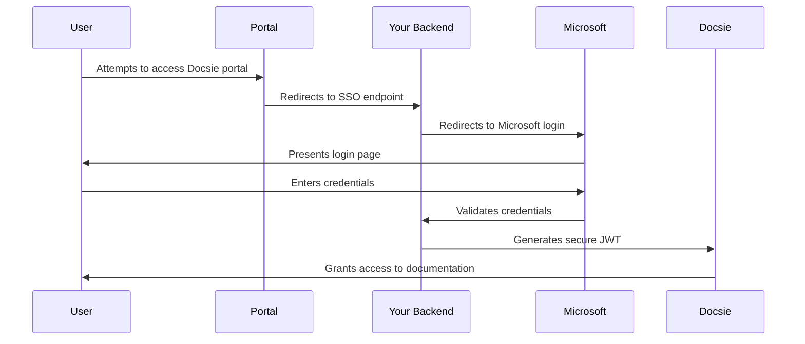

# Microsoft Authentication for Docsie Secure Portals

## Overview
Microsoft Authentication for Docsie Secure Portals enables organizations to secure their documentation portals using Microsoft Azure AD (Entra ID) Single Sign-On (SSO). This integration ensures that only authenticated users from your organization can access your documentation portals.

## How It Works

### Authentication Flow
1. When users attempt to access your secured Docsie portal, they are redirected to Microsoft's login page
2. Users authenticate using their Microsoft organizational credentials
3. Upon successful authentication, they are automatically redirected to your Docsie portal
4. The portal validates their access using a secure JWT token

## Setup Instructions

### 1. Prerequisites
- A Microsoft Azure account with administrative access
- A Docsie portal with master key
- Your Docsie portal URL

### 2. Configure Microsoft Azure AD

1. Access the Microsoft Entra Admin Center
   - Navigate to [entra.microsoft.com](https://entra.microsoft.com)
   - Sign in with administrative privileges

2. Register Your Application
   - Go to **Identity** > **Applications** > **App registrations**
   - Click **New registration**
   - Name your application (e.g., "Docsie Portal Access")
   - Under **Supported account types**, select "Accounts in this organizational directory only"
   - Set the Redirect URI to your portal's callback URL
   - Click **Register**

3. Configure Authentication
   - In your registered app, go to **Authentication**
   - Ensure **Access tokens** and **ID tokens** are selected
   - Save your changes

4. Get Required Credentials
   - Copy the **Application (client) ID**
   - Generate a **Client Secret** under **Certificates & secrets**
   - Note your **Tenant ID** from the overview page

### 3. Configure Docsie Portal

1. Access Your Portal Settings
   - Log in to your Docsie admin dashboard
   - Navigate to Portal Settings
   - Enable Microsoft Authentication
   
2. Enter Azure Credentials
   - Input your Azure Application ID
   - Add your Client Secret
   - Enter your Tenant ID
   - Save the configuration

### 4. Testing the Integration

1. Open an incognito browser window
2. Navigate to your Docsie portal URL
3. Verify that you're redirected to Microsoft login
4. Sign in with your organizational credentials
5. Confirm successful redirect back to your documentation

## Security Considerations

### Authentication Security
- All authentication requests are encrypted using HTTPS
- JWT tokens are signed with your portal's master key
- Session tokens have configurable expiration times
- Failed login attempts are logged and monitored

### Best Practices
- Regularly rotate your client secrets
- Configure appropriate token lifetimes
- Implement IP restrictions if needed
- Monitor access logs regularly

## Troubleshooting

### Common Issues

1. **Unable to Login**
   - Verify Azure AD credentials are correct
   - Ensure user has appropriate permissions
   - Check redirect URI configuration

2. **Access Denied After Login**
   - Confirm JWT configuration
   - Verify portal master key
   - Check user permissions in Azure AD

3. **Redirect Errors**
   - Validate all URLs are properly configured
   - Ensure SSL certificates are valid
   - Check for any proxy configuration issues

### Support Resources
- [Microsoft Azure AD Documentation](https://docs.microsoft.com/en-us/azure/active-directory/)
- [Docsie Support Portal](https://help.docsie.io)
- Contact Docsie support for additional assistance

## Limitations and Considerations
- Requires Azure AD Premium for certain features
- Single tenant configuration only
- Internet connectivity required for authentication
- Browser must support cookies and JavaScript

## FAQ

**Q: Can I use this with multiple portals?**
A: Yes, you can configure different Azure AD applications for each portal or use a single application for multiple portals.

**Q: What happens if Azure AD is down?**
A: Users won't be able to authenticate during an Azure AD outage. Consider implementing a backup authentication method for critical access.

**Q: Can I customize the login page?**
A: Yes, Microsoft provides options to customize the login experience through Azure AD branding settings.

**Q: Is multi-factor authentication (MFA) supported?**
A: Yes, if MFA is enabled in your Azure AD tenant, it will be enforced during the authentication process. 